# ACME AIR · Aplicación móvil (HTML y CSS)

Maquetación de la aplicación web adaptable de **ACME AIR**, una aerolínea internacional que renueva su experiencia digital. El proyecto reproduce las vistas entregadas por el departamento de diseño UI/UX, con navegación simulada mediante enlaces y desarrollado **únicamente con HTML5 y CSS3** (sin JavaScript).

## Objetivo

Resolver los problemas de la interfaz anterior (diseño no adaptativo, navegación confusa, inconsistencia visual y accesibilidad limitada) con una interfaz limpia, intuitiva y responsive, coherente desde el inicio de sesión hasta la gestión de vuelos.

## Integrantes

| Integrante | Vistas |
|---|---|
| Michael Martinez | Login, registro, crear contraseña y recuperar contraseña |
| Juan Manuel Polanco Perdomo | Menú principal y búsqueda de vuelos |
| Marlon Sanabria | Vuelos disponibles, check-in y mis vuelos |

La base común (hojas de estilo, assets, plantilla y convenciones) se definió entre los tres antes de empezar las vistas.

## Estado del proyecto

Las 9 vistas del enunciado están integradas en `main` y la navegación simulada entre ellas funciona completa.

## Estructura del proyecto

```
.
├── index.html               # Login
├── menu.html                # Menú principal
├── registro.html            # Registro
├── crear-contrasena.html    # Crear contraseña
├── recuperar.html           # Recuperar contraseña
├── buscar-vuelos.html       # Búsqueda de vuelos
├── vuelos.html              # Vuelos disponibles
├── checkin.html             # Check-in
├── mis-vuelos.html          # Mis vuelos
├── css/
│   ├── style.css            # Variables, reset, tipografía, botones, enlaces
│   ├── forms.css            # Formularios
│   ├── layout.css           # Estructura de página, tarjetas y componentes
│   └── responsive.css       # Tablet (768 px) y escritorio (1024 px)
├── img/
│   ├── logo.svg · logo-blanco.svg · favicon.svg
│   ├── icons/
│   └── backgrounds/
└── docs/
    ├── plantilla.html       # Esqueleto para crear una vista nueva
    ├── convenciones.md      # Componentes, nombres de clases, accesibilidad y Git
    └── capturas/            # Capturas de pantalla usadas en este README
```

## Guía de navegación

| Vista | Acción | Destino |
|---|---|---|
| Login | Ingresar | Menú principal |
| Login | Crear cuenta | Registro |
| Login | ¿Has olvidado tu contraseña? | Recuperar contraseña |
| Registro | Guardar | Crear contraseña |
| Recuperar contraseña | Enviar | Crear contraseña |
| Crear contraseña | Guardar | Menú principal |
| Menú principal | Buscar vuelos | Búsqueda de vuelos |
| Menú principal | Check In | Check-in |
| Menú principal | Mis Vuelos | Mis vuelos |
| Búsqueda de vuelos | Buscar | Vuelos disponibles |
| Vuelos disponibles | Volver | Menú principal |
| Check-in | Guardar | Menú principal |
| Mis vuelos | Volver | Menú principal |
| Todas las vistas con "Cerrar Sesión" | Cerrar Sesión | Login |

## Capturas

### Vistas en móvil

<table>
  <tr>
    <td align="center">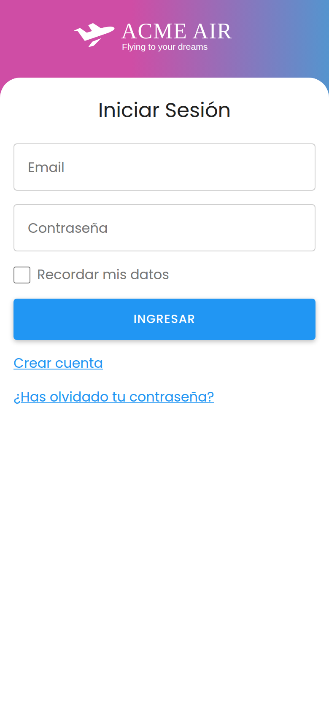<br><sub>Login</sub></td>
    <td align="center">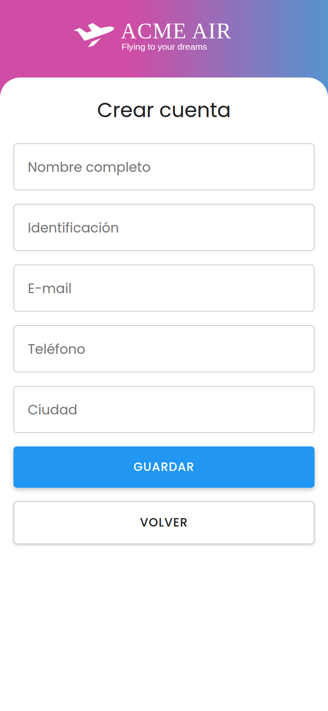<br><sub>Registro</sub></td>
    <td align="center">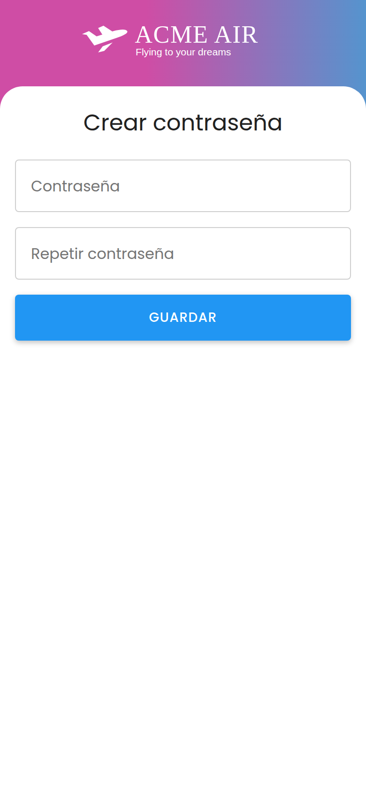<br><sub>Crear contraseña</sub></td>
  </tr>
  <tr>
    <td align="center">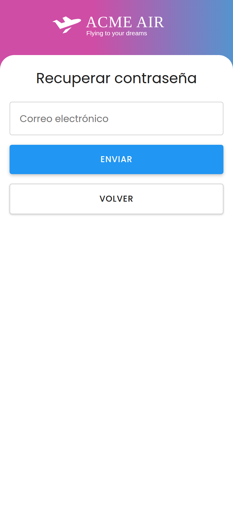<br><sub>Recuperar contraseña</sub></td>
    <td align="center">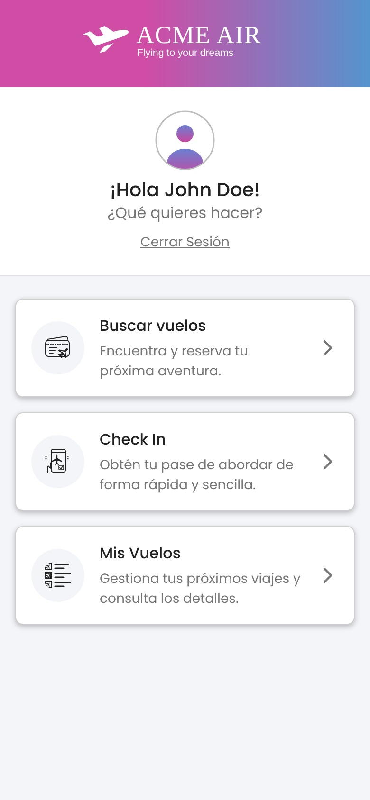<br><sub>Menú principal</sub></td>
    <td align="center">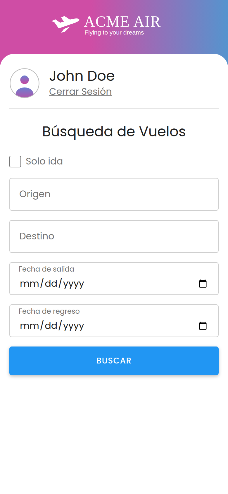<br><sub>Búsqueda de vuelos</sub></td>
  </tr>
  <tr>
    <td align="center">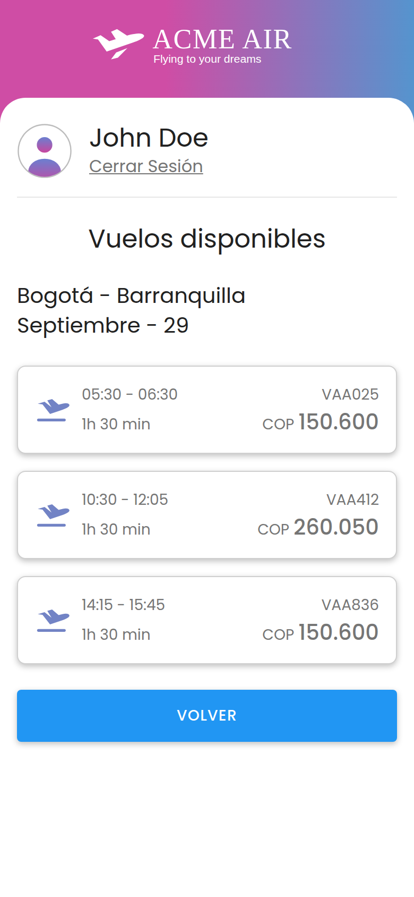<br><sub>Vuelos disponibles</sub></td>
    <td align="center">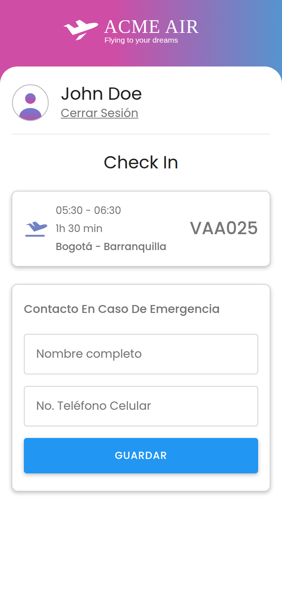<br><sub>Check-in</sub></td>
    <td align="center">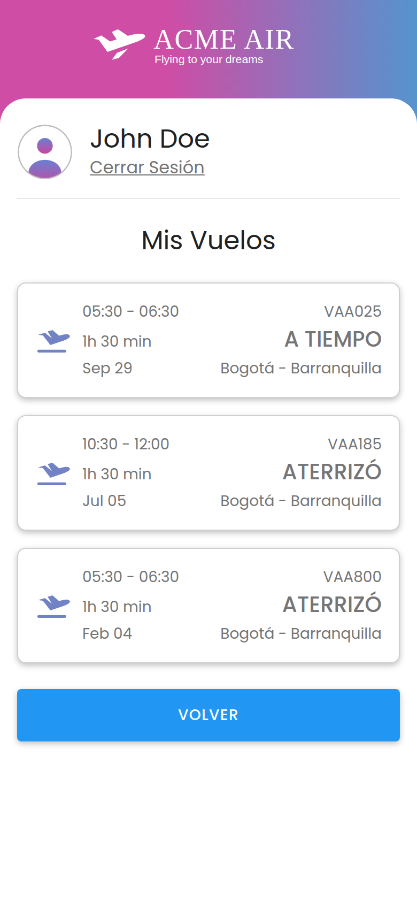<br><sub>Mis vuelos</sub></td>
  </tr>
</table>

### Tablet y escritorio

**Menú principal (escritorio, 1280 px):** barra lateral con el perfil y las tarjetas de opciones en una cuadrícula centrada; en tablet se mantiene la barra lateral y en celular el perfil pasa arriba.

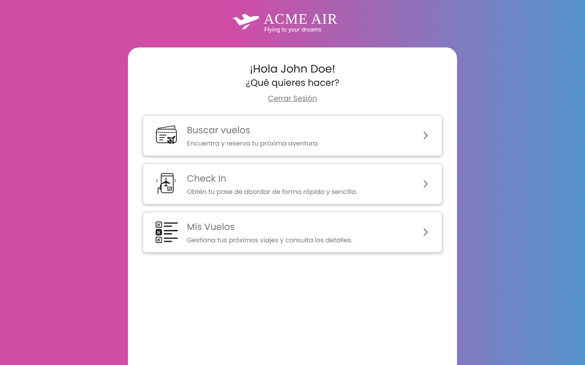

**Búsqueda de vuelos (tablet, 768 px):** origen, destino y fechas en dos columnas.

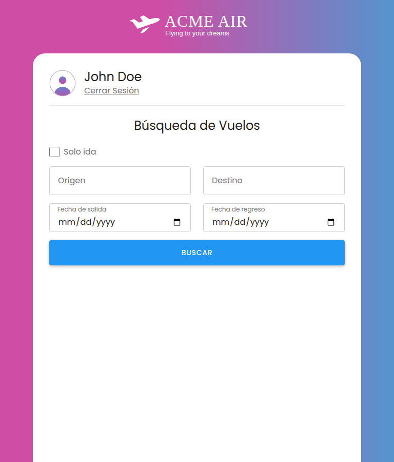

**Vuelos disponibles (escritorio, 1280 px):** la vista se centra y deja ver el degradado a los lados.

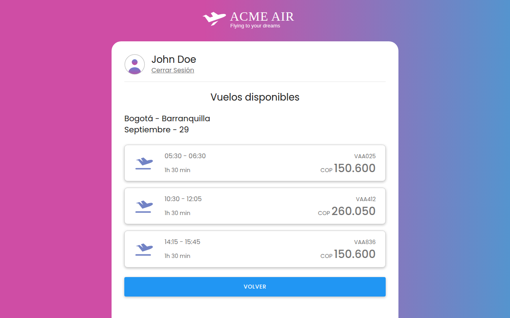

## Diseño y responsividad

- **Estilo corporativo:** degradado rosa a azul, tipografía Poppins (con Open Sans como respaldo) y botones principales con sombra y `hover` con `transform: scale(1.02)`.
- **Mobile first** con tres puntos de control: 320 px (móvil pequeño), 768 px (tablet) y 1024 px (escritorio, vista centrada con padding lateral). El menú agrega uno más a 1440 px para pantallas grandes.
- **Accesibilidad:** HTML semántico, `label` en todos los campos, textos alternativos en imágenes y foco visible con teclado.

## Cómo ejecutarlo

No requiere instalación ni compilación. Abre `index.html` en el navegador o, desde Visual Studio Code, usa la extensión **Live Server**.

## Flujo de trabajo

- `main` contiene la versión integrada del proyecto.
- Cada cambio se desarrolla en su propia rama creada desde `main` (por ejemplo `feature/menu`, `feature/buscar-vuelos` o `fix/registro-boton-guardar`) y se integra con un Pull Request.
- Los mensajes de commit siguen Conventional Commits en español (`feat:`, `fix:`, `docs:`…).
- Detalle de componentes, nombres de clases y reglas de equipo en [`docs/convenciones.md`](docs/convenciones.md).
